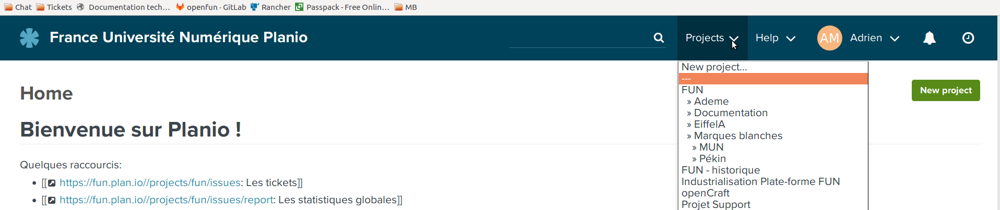
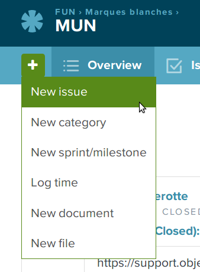
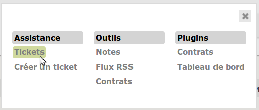

Création de tickets
===================

Nous avons 2 cas de figures pour créer des tickets :

- concernant l'équipe de FUN pour un ajout / modification sur les MB, un problème sur une plateforme, développement d'une fonctionnalité...
- concernant l'équipe d'Objectif Libre pour un MEP, reconstruction des contenus statiques...

FUN
***

Sur Planio, choisir le projet sur lequel est attribué le ticket.

Puis cliquer sur le "+" en haut à gauche et selectionner "New issue".

Vous arrivez alors sur la page de création du ticket.

`Voir la création d'un ticket planio <../outils/004_planio.html>`_

Objectif Libre
**************

Pour une tâche qui conecerne Objectif Libre, il faut faire 2 tickets :

- un ticket sur GLPI

Il faut cliquer sur le hamburger en haut à droute de l'écran.

Puis cliquer sur "ticket".

Vous arrivez alors sur la page de recherche des tickets. Puis il faut cliquer sur le "+" en haut à gauche pour créer le ticket.

`Voir la création d'un ticket glpi <../outils/005_glpi.html>`_

Il faut ensuite créer un ticket Planio avec le numéro du ticket GLPI en description pour garder une trace.