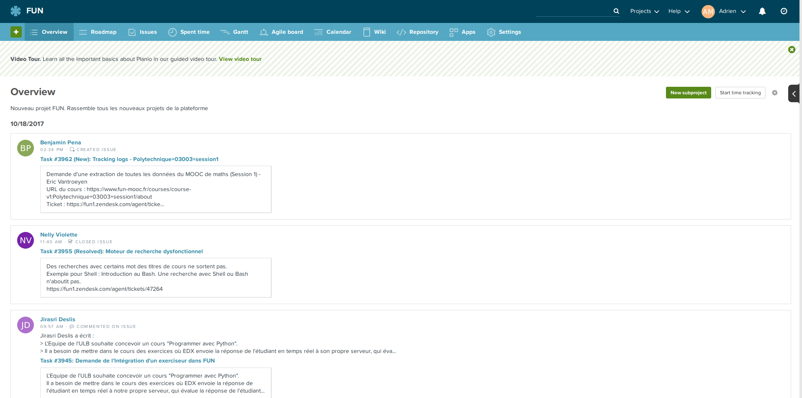
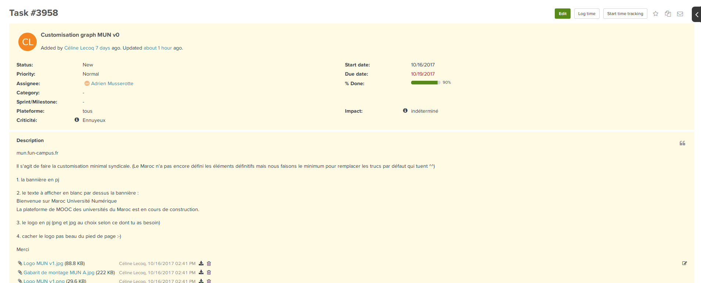
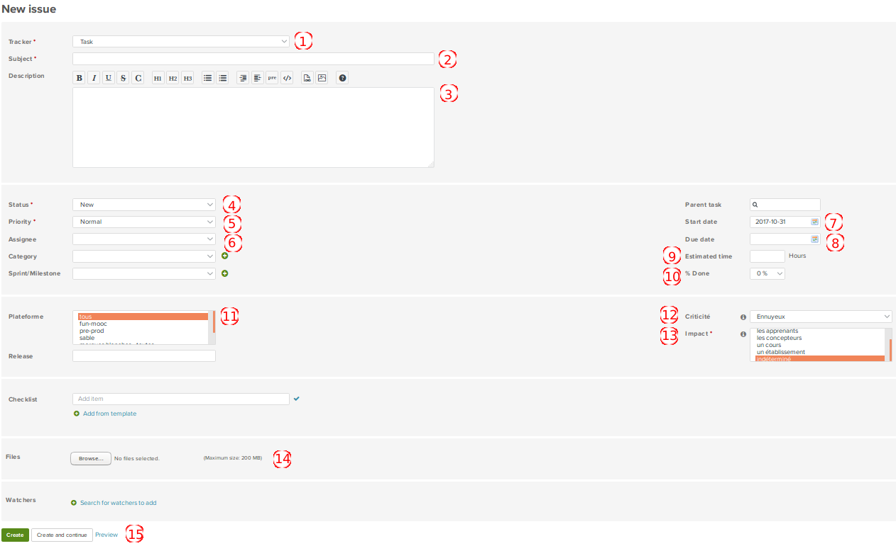

Planio
======

Adresse
*******
https://fun.plan.io

Description
***********
Interface utilisateur qui permet de créer des tickets et de les assigner.

Les tickets ont plusieurs critères qui permettent de définir leur status, leur priorité, leur criticité, la personne assigné, etc.

Création d'un ticket
********************

Pour créer un ticket, on a besoin de plusieurs information :

- 1/ Tracker : peut prendre 2 valeurs, soit "Task" (une tâche à faire) soit "Bug".
- 2/ Subject : le sujet du ticket.
- 3/ Description : la description de la tâche à faire / du bug...
- 4/ Status : le status de la tâche. Peut prendre plusieurs valeurs :
    - "New" : la tâche vient d'être assigné.
    - "In progress" : quelqu'un est entrain de travailler sur la tâche.
    - "Feedback" : attente d'un retour.
    - "Resolved" : la tâche est résolu.
    - "Verified" : la tâche est vérifié.
    - "Closed" : la tâche est terminé.
    - "Rejected" : la tâche est rejeté.
    - "Reopened" : la tache est ré-ouverte.
- 5/ Priority : peut prendre 2 valeurs, soit "Normal", soit "Immediat".
- 6/ Assignee : liste déroulante sur laquelle on affecte un membre de l'équipe sur cette tâche.
- 7/ Start date : la date de début de la tâche.
- 8/ Due date : la date limitte de la tâche.
- 9/ Estimated time : le nombre d'heures estimées sur la tâche.
- 10/ % Done : le pourcentage finalisé de la tâche.
- 11/ Plateforme : la plateforme sur laquelle est assigné la tâche.
- 12/ Criticité : le niveau de criticité de la tâche. Peut prendre 4 valeurs : "Important", "Sérieux", "Ennuyeux" ou "Oubliable".
- 13/ Impact : l'impacte de la tâche.
- 14/ Files : on peut ajouté des fichiers joint à la tâches comme des images à placer dans du HTML, des images pour montrer un bug, un fichier txt...
- 15/ Create et Create and continue : boutons pour ouvrir le ticket.

Prérequis
*********
- Avoir un compte planio donné par un admin