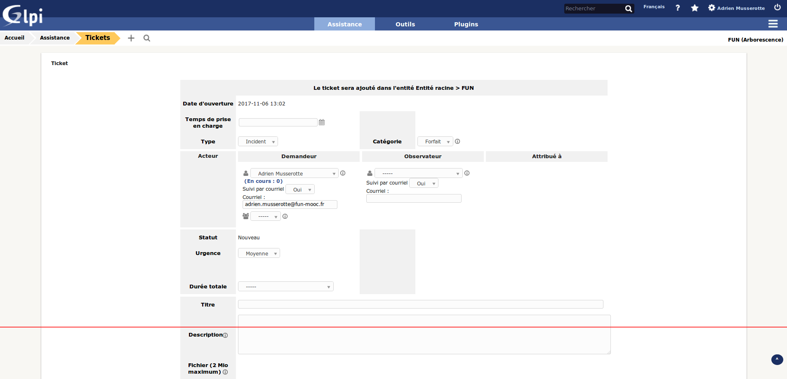
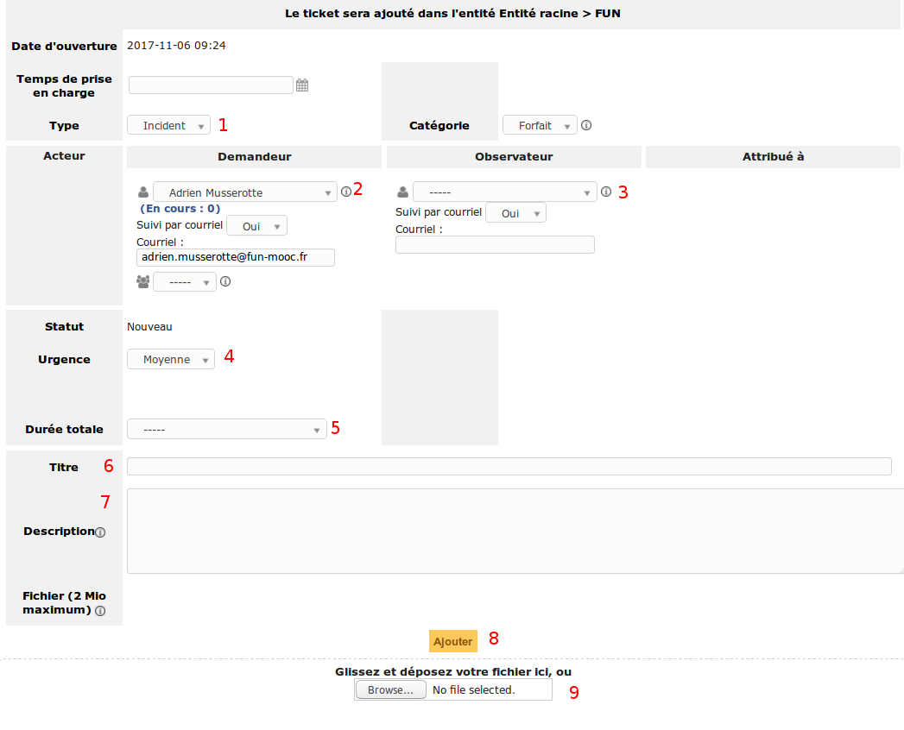

GLPI
====

Adresse
*******
https://support.objectif-libre.com/glpi

Description
***********
Interface utilisateur qui permet de créer des tickets et de les assigner.

Création d'un ticket
********************
Pour créer un ticket, on a besoin de plusieurs information :

- 1/ Type : peut prendre 2 valeurs, soit "Incident" soit "Demande".
- 2/ Demandeur : la personne qui fait la demande de ticket (soit même).
- 3/ Observateur : une personne observatrice du ticket (chef de projet, dev...).
- 4/ Urgence : niveau de l'urgence.
- 5/ Durée totale : la durée de la tâche.
- 6/ Titre : le titre de la tâche.
- 7/ Description : la description de la tâche.
- 8/ Ajouter : ajouter le ticket.
- 9/ Dépot de fichier : ajouter un fichier à joindre avec le ticket.

Utilité d'un ticket
*******************
Les tickets sont remplis pour 2 tâches:

- les corrections de bogues ou les tâches de maintenances;
- les développement de nouvelles fonctionnalités.

Bien remplir les informations permet à tout le monde d’apprécier une meilleure vision sur la production.

Prérequis
*********
- Demander à un admin un compte
- Admin : devra faire un ticket GLPI pour la création du compte