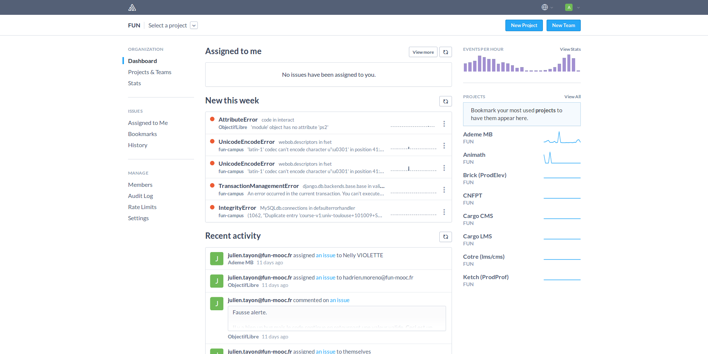
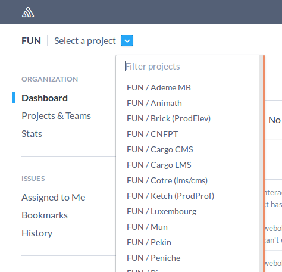
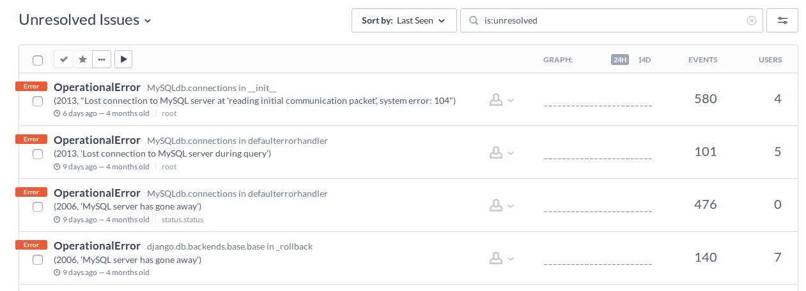

Sentry
======

Adresse
*******
https://sentry.fun-mooc.fr/fun/

Description
***********

Interface utilisateur qui permet de voir les bugs sur les différentes machines.

On peut sélectionner le projet qui nous interesse :

Et y voir toutes les erreurs :

Prérequis
*********
- Avoir un compte Sentry donné par un admin