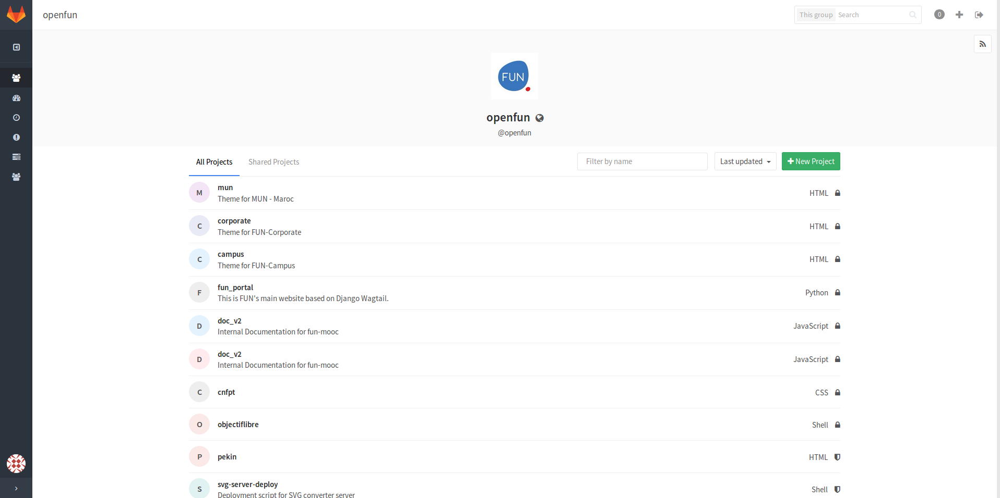

Gitlab
======

Interface utilisateur web autour de git qui est un clone de github

Adresse:

https://git.alt.openfun.fr

Prérequis
*********

- Avoir un compte gitlab donné par un admin
- renseigner sa clé ssh (publique), vérifier qu'on appartient au groupe adéquat